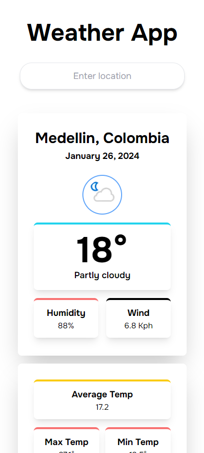
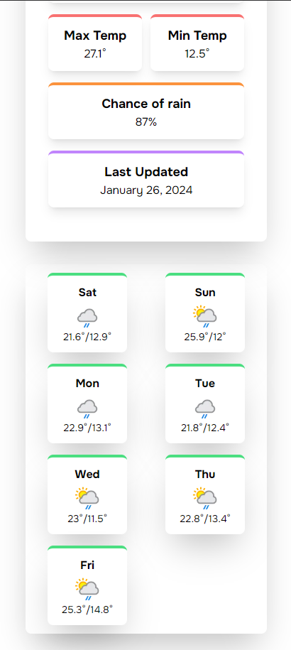
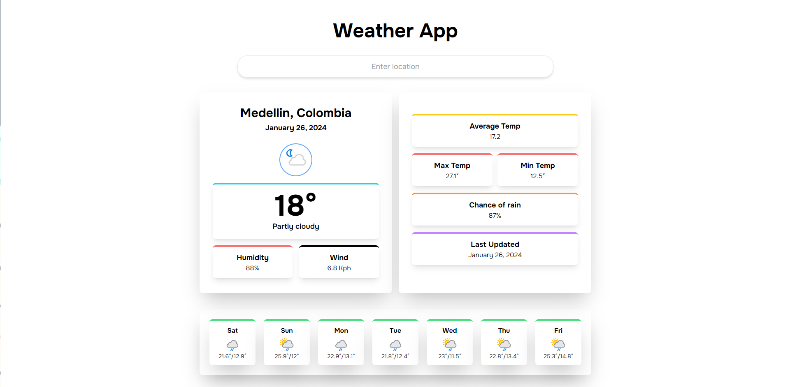

# Weather App

This is an application developed with **REACT** and **TAILWIND**. The app fetch the data from [WeatherApi]((https://www.weatherapi.com/)) and provides the weather information of the day and week for the next seven days.

## Steps to run the project

1. Clone the repo: git clone https://github.com/santiagomac/weather-app.git
2. yarn
3. yarn dev

# Screenshots

## Mobile POV

    
    

## Desktop POV

