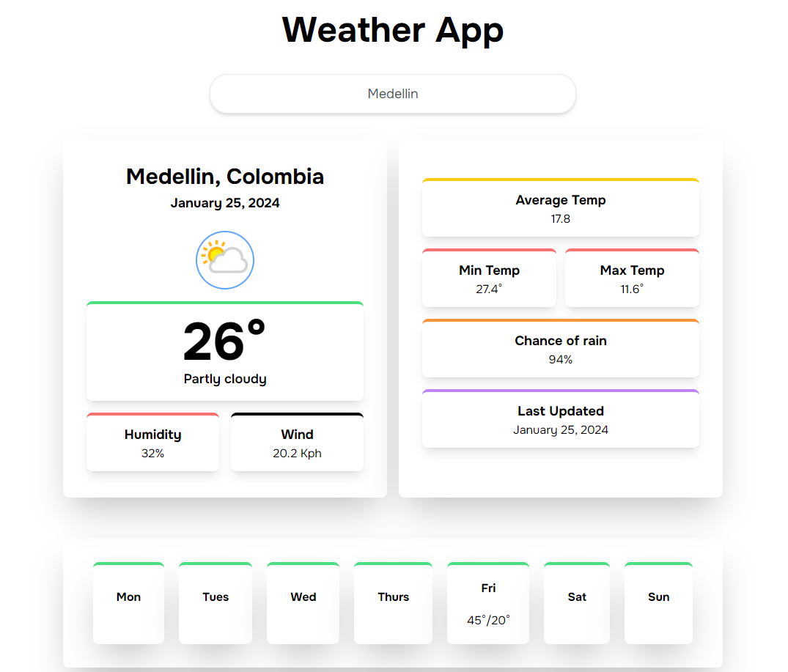

# Weather App

This is a application that provides the weather info from a city.

Currently, two official plugins are available:

- [@vitejs/plugin-react](https://github.com/vitejs/vite-plugin-react/blob/main/packages/plugin-react/README.md) uses [Babel](https://babeljs.io/) for Fast Refresh
- [@vitejs/plugin-react-swc](https://github.com/vitejs/vite-plugin-react-swc) uses [SWC](https://swc.rs/) for Fast Refresh

## Step to run the project

1. Clone the repo: git clone https://github.com/santiagomac/weather-app.git
2. yarn
3. yarn dev

```` JavaScript
 const edit = new Edit();
 ````
# Screenshots

